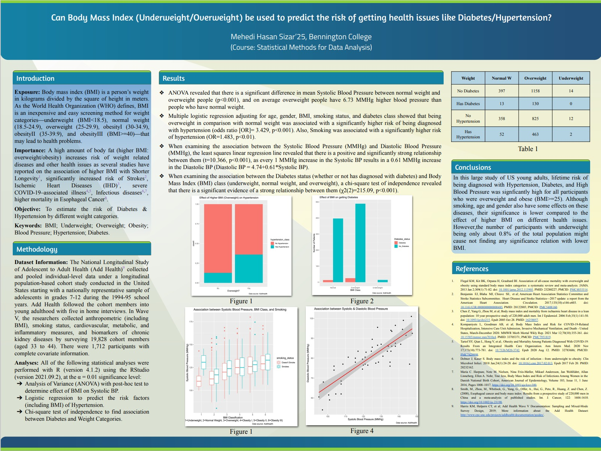

# diabetes-predictor-using-bmi
Can Body Mass Index (Underweight/Overweight) be used to predict the risk of getting health issues like Diabetes/Hypertension?

Download Higher Resolution Here: [Final_Poster.pdf](https://github.com/mhsizar/diabetes-predictor-using-bmi/files/9658776/Final_Poster.pptx.pdf)
